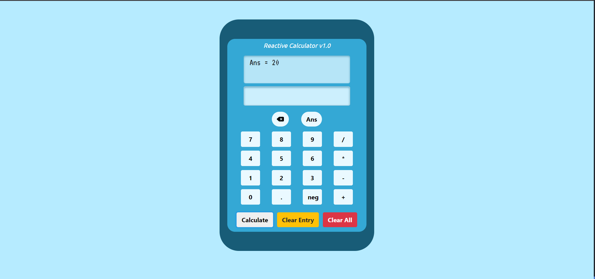

# Reactive-Calculator
A calculator built with React.js to demonstrate mathematic logic.

## Description
A simple calculator made using React.js and styled with Bootstrap. Using only two components (App.js and Screen.js), this application takes a user's input and performs calculations (in the order of PEMDAS!). A user can provide input either via keyboard or by clicking the calculator buttons, which includes traditional functions such as calculating, clearing entry, clearing all screens, and using the previous answer in the current formula.

Currently, only multiply/divide/add/subtract operations are available in the V1.0 build. Parenthesis and exponential operators will be added in a future build. But that doesn't discount the logic used to perform mathematical operations in the correct order from left to right. This project is a great demonstration of creating complex logic to perform a simple task that is not hardcoded.

The main skill set used here is taking strings and filtering using regex. The input is provided as a string, in which its value determines the path of logic to take. 

## Deployed Link
https://velvety-treacle-71a2a2.netlify.app/

## Goals for Deployment

- [x] The calculator itself is presentable without visual frontend errors
- [x] There will be a layout of buttons to perform operations, neatly organized
- [x] There will be a button to perform multiplication, division, addition, and subtraction
- [x] There will be buttons numbered 0-9, as well as the option to use decimals and negative numbers
- [x] The user is able to provide input either using a keyboard or a mouse
- [x] The user's input will be validated to ONLY accept numbers or symbols required to perform operations
- [x] Symbol input must not break the string to where operations can't be performed (e.g. multiple periods, no repetitive symbols like "/*")
- [x] Order of operations must follow PEMDAS, left-to-right order
- [x] The final calculation shall be displayed on the screen
- [x] The user can clear their entry or all screens
- [x] New input can be entered without clearing all screens

## Stretch Goals (v2.0)
- Add parenthesis and exponential expressions
- Allow calculator to be used in landscape orientation
- Turn the app into a PWA
- Optimize mobile interface

## Initial Design
My initial design of the Reactive Calculator, designed using Figma.

## Final Product
Screenshot of the final product for this project.

